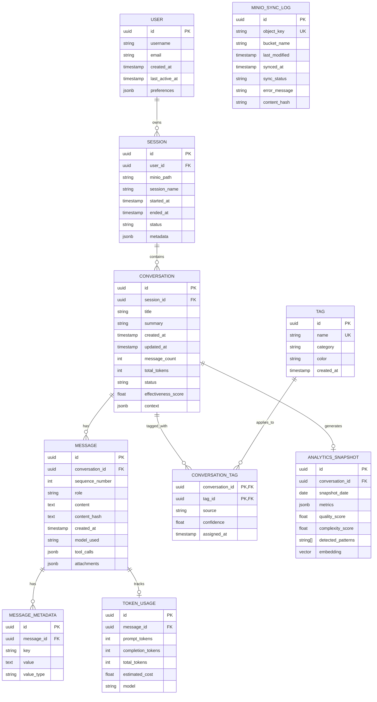

# Data Model & Database Design - Prompt Analytics Dashboard

## Executive Summary

This document presents a comprehensive data model design for the Prompt Analytics Dashboard, focusing on storing, analyzing, and visualizing Claude Code conversation prompts. The design prioritizes query performance for analytics, flexibility for semi-structured data, and efficient synchronization with the MinIO object storage system.

---

## 1. Data Model Design

### 1.1 Entity-Relationship Diagram



### 1.2 Core Entities Description

| Entity | Purpose | Key Characteristics |
|--------|---------|---------------------|
| **User** | Represents dashboard users | Single user initially, extensible for multi-tenancy |
| **Session** | Groups related conversations | Maps to Claude Code work sessions |
| **Conversation** | Single prompt-response thread | Core unit of analysis |
| **Message** | Individual prompt or response | Contains actual content and metadata |
| **Token_Usage** | Tracks API consumption | Essential for cost analysis |
| **Tag** | Categorical labels | Supports manual and auto-tagging |
| **Analytics_Snapshot** | Pre-computed metrics | Powers fast dashboard queries |
| **MinIO_Sync_Log** | Tracks object storage sync | Enables incremental imports |

### 1.3 Relationships and Cardinality

- **User to Session**: 1:N - A user can have many sessions
- **Session to Conversation**: 1:N - A session contains multiple conversations
- **Conversation to Message**: 1:N - A conversation has ordered messages
- **Message to Token_Usage**: 1:1 - Each message has one token usage record
- **Conversation to Tag**: M:N - Many-to-many through junction table
- **Conversation to Analytics_Snapshot**: 1:N - Historical snapshots for trend analysis

---

## 2. Schema Design

### 2.1 SQL Schema (PostgreSQL)

```sql
-- Enable required extensions
CREATE EXTENSION IF NOT EXISTS "uuid-ossp";
CREATE EXTENSION IF NOT EXISTS "pg_trgm";      -- For fuzzy text search
CREATE EXTENSION IF NOT EXISTS "vector";        -- pgvector for embeddings

-- =============================================
-- CORE TABLES
-- =============================================

CREATE TABLE users (
    id UUID PRIMARY KEY DEFAULT uuid_generate_v4(),
    username VARCHAR(100) NOT NULL UNIQUE,
    email VARCHAR(255),
    created_at TIMESTAMPTZ NOT NULL DEFAULT NOW(),
    last_active_at TIMESTAMPTZ,
    preferences JSONB DEFAULT '{}'::jsonb,

    CONSTRAINT users_email_format CHECK (email ~* '^[A-Za-z0-9._%+-]+@[A-Za-z0-9.-]+\.[A-Za-z]{2,}$')
);

CREATE TABLE sessions (
    id UUID PRIMARY KEY DEFAULT uuid_generate_v4(),
    user_id UUID NOT NULL REFERENCES users(id) ON DELETE CASCADE,
    minio_path VARCHAR(1000) NOT NULL,
    session_name VARCHAR(500),
    started_at TIMESTAMPTZ NOT NULL,
    ended_at TIMESTAMPTZ,
    status VARCHAR(50) NOT NULL DEFAULT 'active',
    metadata JSONB DEFAULT '{}'::jsonb,
    created_at TIMESTAMPTZ NOT NULL DEFAULT NOW(),
    updated_at TIMESTAMPTZ NOT NULL DEFAULT NOW(),

    CONSTRAINT sessions_status_check CHECK (status IN ('active', 'completed', 'archived')),
    CONSTRAINT sessions_minio_path_unique UNIQUE (minio_path)
);

CREATE TABLE conversations (
    id UUID PRIMARY KEY DEFAULT uuid_generate_v4(),
    session_id UUID NOT NULL REFERENCES sessions(id) ON DELETE CASCADE,
    title VARCHAR(500),
    summary TEXT,
    created_at TIMESTAMPTZ NOT NULL DEFAULT NOW(),
    updated_at TIMESTAMPTZ NOT NULL DEFAULT NOW(),
    message_count INT NOT NULL DEFAULT 0,
    total_tokens INT NOT NULL DEFAULT 0,
    status VARCHAR(50) NOT NULL DEFAULT 'active',
    effectiveness_score DECIMAL(5,4),
    context JSONB DEFAULT '{}'::jsonb,

    CONSTRAINT conversations_status_check CHECK (status IN ('active', 'completed', 'archived'))
);

CREATE TABLE messages (
    id UUID PRIMARY KEY DEFAULT uuid_generate_v4(),
    conversation_id UUID NOT NULL REFERENCES conversations(id) ON DELETE CASCADE,
    sequence_number INT NOT NULL,
    role VARCHAR(50) NOT NULL,
    content TEXT NOT NULL,
    content_hash VARCHAR(64) NOT NULL,
    created_at TIMESTAMPTZ NOT NULL DEFAULT NOW(),
    model_used VARCHAR(100),
    tool_calls JSONB,
    attachments JSONB,

    CONSTRAINT messages_role_check CHECK (role IN ('user', 'assistant', 'system', 'tool')),
    CONSTRAINT messages_sequence_unique UNIQUE (conversation_id, sequence_number)
);

CREATE TABLE message_metadata (
    id UUID PRIMARY KEY DEFAULT uuid_generate_v4(),
    message_id UUID NOT NULL REFERENCES messages(id) ON DELETE CASCADE,
    key VARCHAR(255) NOT NULL,
    value TEXT,
    value_type VARCHAR(50) NOT NULL DEFAULT 'string',

    CONSTRAINT message_metadata_unique UNIQUE (message_id, key)
);

CREATE TABLE token_usage (
    id UUID PRIMARY KEY DEFAULT uuid_generate_v4(),
    message_id UUID NOT NULL REFERENCES messages(id) ON DELETE CASCADE UNIQUE,
    prompt_tokens INT NOT NULL DEFAULT 0,
    completion_tokens INT NOT NULL DEFAULT 0,
    total_tokens INT GENERATED ALWAYS AS (prompt_tokens + completion_tokens) STORED,
    estimated_cost DECIMAL(10,6),
    model VARCHAR(100),
    created_at TIMESTAMPTZ NOT NULL DEFAULT NOW()
);

CREATE TABLE tags (
    id UUID PRIMARY KEY DEFAULT uuid_generate_v4(),
    name VARCHAR(100) NOT NULL UNIQUE,
    category VARCHAR(100),
    color VARCHAR(7) DEFAULT '#6366f1',
    created_at TIMESTAMPTZ NOT NULL DEFAULT NOW()
);

CREATE TABLE conversation_tags (
    conversation_id UUID NOT NULL REFERENCES conversations(id) ON DELETE CASCADE,
    tag_id UUID NOT NULL REFERENCES tags(id) ON DELETE CASCADE,
    source VARCHAR(50) NOT NULL DEFAULT 'manual',
    confidence DECIMAL(5,4) DEFAULT 1.0,
    assigned_at TIMESTAMPTZ NOT NULL DEFAULT NOW(),

    PRIMARY KEY (conversation_id, tag_id),
    CONSTRAINT conversation_tags_source_check CHECK (source IN ('manual', 'auto', 'ml'))
);

-- =============================================
-- ANALYTICS TABLES
-- =============================================

CREATE TABLE analytics_snapshots (
    id UUID PRIMARY KEY DEFAULT uuid_generate_v4(),
    conversation_id UUID NOT NULL REFERENCES conversations(id) ON DELETE CASCADE,
    snapshot_date DATE NOT NULL DEFAULT CURRENT_DATE,
    metrics JSONB NOT NULL DEFAULT '{}'::jsonb,
    quality_score DECIMAL(5,4),
    complexity_score DECIMAL(5,4),
    detected_patterns TEXT[],
    embedding vector(1536),  -- OpenAI ada-002 dimension
    created_at TIMESTAMPTZ NOT NULL DEFAULT NOW(),

    CONSTRAINT analytics_snapshot_unique UNIQUE (conversation_id, snapshot_date)
);

-- =============================================
-- SYNC & AUDIT TABLES
-- =============================================

CREATE TABLE minio_sync_log (
    id UUID PRIMARY KEY DEFAULT uuid_generate_v4(),
    object_key VARCHAR(1000) NOT NULL UNIQUE,
    bucket_name VARCHAR(255) NOT NULL,
    last_modified TIMESTAMPTZ NOT NULL,
    synced_at TIMESTAMPTZ NOT NULL DEFAULT NOW(),
    sync_status VARCHAR(50) NOT NULL DEFAULT 'pending',
    error_message TEXT,
    content_hash VARCHAR(64),
    file_size_bytes BIGINT,

    CONSTRAINT sync_status_check CHECK (sync_status IN ('pending', 'syncing', 'completed', 'failed', 'skipped'))
);

CREATE TABLE data_quality_log (
    id UUID PRIMARY KEY DEFAULT uuid_generate_v4(),
    entity_type VARCHAR(100) NOT NULL,
    entity_id UUID NOT NULL,
    check_name VARCHAR(255) NOT NULL,
    check_result BOOLEAN NOT NULL,
    details JSONB,
    checked_at TIMESTAMPTZ NOT NULL DEFAULT NOW()
);

-- =============================================
-- INDEXES FOR PERFORMANCE
-- =============================================

-- Session indexes
CREATE INDEX idx_sessions_user_id ON sessions(user_id);
CREATE INDEX idx_sessions_started_at ON sessions(started_at DESC);
CREATE INDEX idx_sessions_status ON sessions(status);

-- Conversation indexes
CREATE INDEX idx_conversations_session_id ON conversations(session_id);
CREATE INDEX idx_conversations_created_at ON conversations(created_at DESC);
CREATE INDEX idx_conversations_status ON conversations(status);
CREATE INDEX idx_conversations_effectiveness ON conversations(effectiveness_score DESC NULLS LAST);

-- Message indexes
CREATE INDEX idx_messages_conversation_id ON messages(conversation_id);
CREATE INDEX idx_messages_created_at ON messages(created_at DESC);
CREATE INDEX idx_messages_role ON messages(role);
CREATE INDEX idx_messages_content_trgm ON messages USING gin(content gin_trgm_ops);  -- Fuzzy search
CREATE INDEX idx_messages_content_hash ON messages(content_hash);  -- Deduplication

-- Token usage indexes
CREATE INDEX idx_token_usage_message_id ON token_usage(message_id);
CREATE INDEX idx_token_usage_model ON token_usage(model);
CREATE INDEX idx_token_usage_created_at ON token_usage(created_at DESC);

-- Tag indexes
CREATE INDEX idx_tags_category ON tags(category);
CREATE INDEX idx_conversation_tags_tag_id ON conversation_tags(tag_id);

-- Analytics indexes
CREATE INDEX idx_analytics_conversation_id ON analytics_snapshots(conversation_id);
CREATE INDEX idx_analytics_snapshot_date ON analytics_snapshots(snapshot_date DESC);
CREATE INDEX idx_analytics_embedding ON analytics_snapshots USING ivfflat (embedding vector_cosine_ops) WITH (lists = 100);

-- Sync log indexes
CREATE INDEX idx_minio_sync_status ON minio_sync_log(sync_status);
CREATE INDEX idx_minio_sync_last_modified ON minio_sync_log(last_modified DESC);

-- =============================================
-- MATERIALIZED VIEWS FOR DASHBOARDS
-- =============================================

CREATE MATERIALIZED VIEW mv_daily_usage_stats AS
SELECT
    DATE(m.created_at) as usage_date,
    COUNT(DISTINCT c.id) as conversation_count,
    COUNT(m.id) as message_count,
    SUM(tu.total_tokens) as total_tokens,
    SUM(tu.estimated_cost) as total_cost,
    AVG(c.effectiveness_score) as avg_effectiveness,
    COUNT(DISTINCT c.session_id) as session_count
FROM messages m
JOIN conversations c ON m.conversation_id = c.id
LEFT JOIN token_usage tu ON m.id = tu.message_id
GROUP BY DATE(m.created_at)
ORDER BY usage_date DESC;

CREATE UNIQUE INDEX idx_mv_daily_usage_date ON mv_daily_usage_stats(usage_date);

CREATE MATERIALIZED VIEW mv_tag_distribution AS
SELECT
    t.id as tag_id,
    t.name as tag_name,
    t.category,
    COUNT(ct.conversation_id) as usage_count,
    AVG(ct.confidence) as avg_confidence
FROM tags t
LEFT JOIN conversation_tags ct ON t.id = ct.tag_id
GROUP BY t.id, t.name, t.category
ORDER BY usage_count DESC;

CREATE UNIQUE INDEX idx_mv_tag_distribution_id ON mv_tag_distribution(tag_id);

CREATE MATERIALIZED VIEW mv_model_usage AS
SELECT
    tu.model,
    COUNT(*) as usage_count,
    SUM(tu.prompt_tokens) as total_prompt_tokens,
    SUM(tu.completion_tokens) as total_completion_tokens,
    SUM(tu.total_tokens) as total_tokens,
    SUM(tu.estimated_cost) as total_cost,
    AVG(tu.total_tokens) as avg_tokens_per_message
FROM token_usage tu
WHERE tu.model IS NOT NULL
GROUP BY tu.model
ORDER BY usage_count DESC;

CREATE UNIQUE INDEX idx_mv_model_usage_model ON mv_model_usage(model);

-- =============================================
-- FUNCTIONS & TRIGGERS
-- =============================================

-- Update conversation stats on message insert
CREATE OR REPLACE FUNCTION update_conversation_stats()
RETURNS TRIGGER AS $$
BEGIN
    UPDATE conversations
    SET
        message_count = (SELECT COUNT(*) FROM messages WHERE conversation_id = NEW.conversation_id),
        total_tokens = COALESCE((
            SELECT SUM(tu.total_tokens)
            FROM messages m
            JOIN token_usage tu ON m.id = tu.message_id
            WHERE m.conversation_id = NEW.conversation_id
        ), 0),
        updated_at = NOW()
    WHERE id = NEW.conversation_id;
    RETURN NEW;
END;
$$ LANGUAGE plpgsql;

CREATE TRIGGER trg_update_conversation_stats
AFTER INSERT OR DELETE ON messages
FOR EACH ROW EXECUTE FUNCTION update_conversation_stats();

-- Update user last active timestamp
CREATE OR REPLACE FUNCTION update_user_last_active()
RETURNS TRIGGER AS $$
BEGIN
    UPDATE users
    SET last_active_at = NOW()
    WHERE id = (SELECT user_id FROM sessions WHERE id = NEW.session_id);
    RETURN NEW;
END;
$$ LANGUAGE plpgsql;

CREATE TRIGGER trg_update_user_last_active
AFTER INSERT ON conversations
FOR EACH ROW EXECUTE FUNCTION update_user_last_active();

-- Refresh materialized views (call periodically via cron or pg_cron)
CREATE OR REPLACE FUNCTION refresh_analytics_views()
RETURNS void AS $$
BEGIN
    REFRESH MATERIALIZED VIEW CONCURRENTLY mv_daily_usage_stats;
    REFRESH MATERIALIZED VIEW CONCURRENTLY mv_tag_distribution;
    REFRESH MATERIALIZED VIEW CONCURRENTLY mv_model_usage;
END;
$$ LANGUAGE plpgsql;
```

### 2.2 Document Schema for Semi-Structured Data

For flexible storage of raw conversation data and extended metadata, we use PostgreSQL's JSONB columns with defined schemas:

```json
// conversations.context JSONB schema
{
  "$schema": "conversation_context_v1",
  "working_directory": "/path/to/project",
  "project_type": "typescript",
  "files_referenced": ["file1.ts", "file2.ts"],
  "git_info": {
    "branch": "main",
    "commit_hash": "abc123"
  },
  "environment": {
    "os": "darwin",
    "shell": "zsh"
  },
  "custom_fields": {}
}

// messages.tool_calls JSONB schema
{
  "calls": [
    {
      "tool_name": "Read",
      "parameters": {"file_path": "/path/to/file"},
      "result_summary": "File contents retrieved",
      "duration_ms": 45
    }
  ],
  "total_tool_calls": 1
}

// analytics_snapshots.metrics JSONB schema
{
  "response_time_ms": 1250,
  "turns_to_completion": 3,
  "code_blocks_count": 2,
  "languages_detected": ["typescript", "sql"],
  "sentiment_score": 0.85,
  "topic_keywords": ["database", "migration"],
  "user_satisfaction": null
}
```

### 2.3 Indexing Strategy Summary

| Index Type | Use Case | Tables Applied |
|------------|----------|----------------|
| **B-tree** | Equality, range queries | All foreign keys, timestamps, status fields |
| **GIN with pg_trgm** | Full-text fuzzy search | messages.content |
| **IVFFlat (vector)** | Semantic similarity search | analytics_snapshots.embedding |
| **Hash** | Exact match lookups | content_hash for deduplication |
| **Partial** | Status-specific queries | Active conversations/sessions |

---

## 3. Analytics Data Structures

### 3.1 Aggregation Tables Design

#### Time-Series Aggregations

```sql
-- Hourly aggregation for real-time dashboards
CREATE TABLE agg_hourly_metrics (
    hour_bucket TIMESTAMPTZ NOT NULL,
    user_id UUID REFERENCES users(id),
    conversation_count INT NOT NULL DEFAULT 0,
    message_count INT NOT NULL DEFAULT 0,
    user_message_count INT NOT NULL DEFAULT 0,
    assistant_message_count INT NOT NULL DEFAULT 0,
    total_tokens INT NOT NULL DEFAULT 0,
    total_cost DECIMAL(10,6) NOT NULL DEFAULT 0,
    avg_response_tokens DECIMAL(10,2),

    PRIMARY KEY (hour_bucket, user_id)
);

-- Daily aggregation for trend analysis
CREATE TABLE agg_daily_metrics (
    date_bucket DATE NOT NULL,
    user_id UUID REFERENCES users(id),
    conversation_count INT NOT NULL DEFAULT 0,
    unique_sessions INT NOT NULL DEFAULT 0,
    message_count INT NOT NULL DEFAULT 0,
    total_tokens INT NOT NULL DEFAULT 0,
    total_cost DECIMAL(10,6) NOT NULL DEFAULT 0,
    avg_conversation_length DECIMAL(10,2),
    avg_effectiveness_score DECIMAL(5,4),
    top_tags JSONB,
    model_distribution JSONB,

    PRIMARY KEY (date_bucket, user_id)
);

-- Weekly/Monthly rollups for historical views
CREATE TABLE agg_weekly_metrics (
    week_start DATE NOT NULL,
    user_id UUID REFERENCES users(id),
    conversation_count INT NOT NULL DEFAULT 0,
    total_tokens INT NOT NULL DEFAULT 0,
    total_cost DECIMAL(10,6) NOT NULL DEFAULT 0,
    most_active_day VARCHAR(10),
    peak_hour INT,
    tag_trends JSONB,

    PRIMARY KEY (week_start, user_id)
);
```

#### Pattern Detection Tables

```sql
-- Store detected prompt patterns/templates
CREATE TABLE prompt_patterns (
    id UUID PRIMARY KEY DEFAULT uuid_generate_v4(),
    pattern_signature VARCHAR(64) NOT NULL UNIQUE,
    pattern_template TEXT NOT NULL,
    example_prompts UUID[] NOT NULL,
    occurrence_count INT NOT NULL DEFAULT 1,
    avg_effectiveness DECIMAL(5,4),
    first_seen_at TIMESTAMPTZ NOT NULL DEFAULT NOW(),
    last_seen_at TIMESTAMPTZ NOT NULL DEFAULT NOW(),
    category VARCHAR(100),
    is_active BOOLEAN DEFAULT true
);

-- Topic clustering results
CREATE TABLE topic_clusters (
    id UUID PRIMARY KEY DEFAULT uuid_generate_v4(),
    cluster_name VARCHAR(255),
    centroid vector(1536),
    member_count INT NOT NULL DEFAULT 0,
    representative_conversations UUID[],
    keywords TEXT[],
    created_at TIMESTAMPTZ NOT NULL DEFAULT NOW(),
    updated_at TIMESTAMPTZ NOT NULL DEFAULT NOW()
);

CREATE TABLE conversation_cluster_membership (
    conversation_id UUID REFERENCES conversations(id) ON DELETE CASCADE,
    cluster_id UUID REFERENCES topic_clusters(id) ON DELETE CASCADE,
    similarity_score DECIMAL(5,4) NOT NULL,
    assigned_at TIMESTAMPTZ NOT NULL DEFAULT NOW(),

    PRIMARY KEY (conversation_id, cluster_id)
);
```

### 3.2 Analytics Query Examples

```sql
-- Usage trend over last 30 days
SELECT
    date_bucket,
    conversation_count,
    total_tokens,
    total_cost,
    LAG(conversation_count) OVER (ORDER BY date_bucket) as prev_day_count,
    ROUND(100.0 * (conversation_count - LAG(conversation_count) OVER (ORDER BY date_bucket)) /
          NULLIF(LAG(conversation_count) OVER (ORDER BY date_bucket), 0), 2) as growth_percent
FROM agg_daily_metrics
WHERE date_bucket >= CURRENT_DATE - INTERVAL '30 days'
ORDER BY date_bucket;

-- Top performing prompt patterns
SELECT
    pp.pattern_template,
    pp.occurrence_count,
    pp.avg_effectiveness,
    pp.category
FROM prompt_patterns pp
WHERE pp.is_active = true
ORDER BY pp.avg_effectiveness DESC, pp.occurrence_count DESC
LIMIT 20;

-- Semantic search for similar conversations
SELECT
    c.id,
    c.title,
    c.summary,
    1 - (a.embedding <=> $1::vector) as similarity
FROM analytics_snapshots a
JOIN conversations c ON a.conversation_id = c.id
WHERE a.embedding IS NOT NULL
ORDER BY a.embedding <=> $1::vector
LIMIT 10;
```

### 3.3 Vector Embeddings Strategy

For semantic search capabilities:

1. **Embedding Model**: OpenAI text-embedding-ada-002 (1536 dimensions) or local alternatives
2. **What to Embed**:
   - Conversation summaries
   - Concatenated user prompts per conversation
   - Detected topic keywords
3. **Storage**: pgvector extension with IVFFlat indexing
4. **Refresh Strategy**: Generate embeddings asynchronously during sync process

---

## 4. MinIO Integration Strategy

### 4.1 Object Storage Structure

```
minio.example.com/
└── claude-prompts/                    # Primary bucket
    ├── sessions/
    │   ├── 2026/
    │   │   ├── 01/
    │   │   │   ├── session-uuid-1/
    │   │   │   │   ├── metadata.json
    │   │   │   │   ├── conversation-1.json
    │   │   │   │   └── conversation-2.json
    │   │   │   └── session-uuid-2/
    │   │   └── 02/
    │   └── ...
    ├── exports/                        # Exported analytics/reports
    │   └── ...
    └── backups/                        # Database backups
        └── ...
```

### 4.2 Expected Data Format

Based on Claude Code output patterns, expected JSON structure:

```json
// conversation-{uuid}.json
{
  "id": "conv-uuid-123",
  "session_id": "session-uuid-456",
  "created_at": "2026-02-02T10:30:00Z",
  "messages": [
    {
      "role": "user",
      "content": "Help me refactor this function...",
      "timestamp": "2026-02-02T10:30:00Z"
    },
    {
      "role": "assistant",
      "content": "I'll help you refactor...",
      "timestamp": "2026-02-02T10:30:05Z",
      "model": "claude-opus-4-5-20251101",
      "usage": {
        "prompt_tokens": 150,
        "completion_tokens": 500
      },
      "tool_use": [
        {"name": "Read", "input": {"file_path": "/path/to/file.ts"}}
      ]
    }
  ],
  "context": {
    "working_directory": "/Users/username/project",
    "project": "prompt-manager"
  }
}
```

### 4.3 Metadata Extraction Strategy

```python
# Pseudocode for metadata extraction pipeline

class MinIOExtractor:
    def extract_metadata(self, object_content: dict) -> dict:
        """Extract structured metadata from conversation JSON"""
        return {
            "conversation_id": object_content.get("id"),
            "session_id": object_content.get("session_id"),
            "created_at": parse_timestamp(object_content.get("created_at")),
            "message_count": len(object_content.get("messages", [])),
            "total_tokens": self._calculate_tokens(object_content),
            "models_used": self._extract_models(object_content),
            "tools_used": self._extract_tools(object_content),
            "context": object_content.get("context", {}),
            "content_hash": self._compute_hash(object_content)
        }

    def _calculate_tokens(self, content: dict) -> int:
        total = 0
        for msg in content.get("messages", []):
            usage = msg.get("usage", {})
            total += usage.get("prompt_tokens", 0)
            total += usage.get("completion_tokens", 0)
        return total

    def _extract_tools(self, content: dict) -> list:
        tools = set()
        for msg in content.get("messages", []):
            for tool in msg.get("tool_use", []):
                tools.add(tool.get("name"))
        return list(tools)
```

### 4.4 Sync Mechanism Design

```
┌─────────────────────────────────────────────────────────────────┐
│                     MinIO Sync Architecture                      │
└─────────────────────────────────────────────────────────────────┘

┌──────────┐     ┌──────────────┐     ┌──────────────┐     ┌────────────┐
│  MinIO   │────>│ Change       │────>│  Sync        │────>│ PostgreSQL │
│  Bucket  │     │ Detector     │     │  Worker      │     │ Database   │
└──────────┘     └──────────────┘     └──────────────┘     └────────────┘
     │                  │                    │                    │
     │                  │                    │                    │
     │           ┌──────▼──────┐      ┌──────▼──────┐      ┌──────▼──────┐
     │           │ List Objects│      │ Parse JSON  │      │ Upsert      │
     │           │ Compare Hash│      │ Extract Meta│      │ Records     │
     │           │ Queue Changed│     │ Validate    │      │ Update MV   │
     │           └─────────────┘      └─────────────┘      └─────────────┘
     │
     └───── MinIO Event Notifications (webhook) ─────────────────────────>
```

**Sync Modes:**

1. **Full Sync**: Initial import, scans all objects
2. **Incremental Sync**: Uses `minio_sync_log` to identify changes
3. **Event-Driven Sync**: MinIO bucket notifications trigger immediate sync

**Implementation Approach:**

```python
# Sync worker pseudocode
async def sync_from_minio():
    # 1. Get list of objects with modification times
    objects = await minio_client.list_objects(
        bucket="claude-prompts",
        prefix="sessions/",
        recursive=True
    )

    # 2. Compare with sync log
    for obj in objects:
        sync_record = await db.get_sync_record(obj.key)

        if not sync_record or sync_record.last_modified < obj.last_modified:
            # 3. Queue for processing
            await queue.enqueue(SyncTask(
                object_key=obj.key,
                action="upsert"
            ))

    # 4. Process queue with rate limiting
    await process_sync_queue(concurrency=5)

async def process_object(object_key: str):
    try:
        # Download and parse
        content = await minio_client.get_object(object_key)
        data = json.loads(content)

        # Extract and validate
        metadata = extractor.extract_metadata(data)
        validate_schema(metadata)

        # Upsert to database
        async with db.transaction():
            await upsert_conversation(metadata, data)
            await update_sync_log(object_key, "completed")

    except Exception as e:
        await update_sync_log(object_key, "failed", str(e))
        raise
```

---

## 5. Migration Strategy

### 5.1 Initial Data Import Approach

**Phase 1: Schema Deployment**

```bash
# Migration script execution order
1. 001_create_extensions.sql     # Enable UUID, pg_trgm, vector
2. 002_create_core_tables.sql    # Users, sessions, conversations, messages
3. 003_create_analytics_tables.sql  # Aggregations, patterns, clusters
4. 004_create_sync_tables.sql    # MinIO sync log, data quality
5. 005_create_indexes.sql        # All performance indexes
6. 006_create_views.sql          # Materialized views
7. 007_create_functions.sql      # Triggers and stored procedures
```

**Phase 2: Bootstrap Data**

```sql
-- Create default user for single-user setup
INSERT INTO users (id, username, email, preferences)
VALUES (
    'a0eebc99-9c0b-4ef8-bb6d-6bb9bd380a11',
    'admin',
    'admin@example.com',
    '{"theme": "dark", "timezone": "UTC"}'::jsonb
);

-- Create default tags
INSERT INTO tags (name, category, color) VALUES
    ('coding', 'activity', '#3b82f6'),
    ('debugging', 'activity', '#ef4444'),
    ('documentation', 'activity', '#10b981'),
    ('refactoring', 'activity', '#f59e0b'),
    ('architecture', 'topic', '#8b5cf6'),
    ('database', 'topic', '#06b6d4'),
    ('api', 'topic', '#ec4899'),
    ('testing', 'activity', '#84cc16');
```

**Phase 3: Initial MinIO Sync**

```python
# Full sync script
async def initial_import():
    # 1. List all existing objects
    all_objects = await minio_client.list_all_objects("claude-prompts")

    # 2. Sort by date (oldest first for consistent timeline)
    all_objects.sort(key=lambda x: x.last_modified)

    # 3. Process in batches
    batch_size = 100
    for batch in chunks(all_objects, batch_size):
        tasks = [process_object(obj.key) for obj in batch]
        results = await asyncio.gather(*tasks, return_exceptions=True)

        # Log progress
        success = sum(1 for r in results if not isinstance(r, Exception))
        print(f"Processed {success}/{len(batch)} objects")

    # 4. Generate initial analytics
    await generate_embeddings_batch()
    await detect_patterns()
    await refresh_materialized_views()
```

### 5.2 Incremental Sync Design

```
┌────────────────────────────────────────────────────────────────┐
│                 Incremental Sync Flow                          │
└────────────────────────────────────────────────────────────────┘

1. DETECT CHANGES
   ┌─────────────────────────────────────────────────────────────┐
   │ SELECT object_key, last_modified FROM minio_sync_log       │
   │ WHERE sync_status = 'completed'                             │
   │                                                             │
   │ Compare with MinIO: list_objects(modified_after=last_sync) │
   └─────────────────────────────────────────────────────────────┘
                              │
                              ▼
2. CATEGORIZE
   ┌─────────────────────────────────────────────────────────────┐
   │ NEW:      Objects not in sync_log                           │
   │ MODIFIED: Objects with newer last_modified                  │
   │ DELETED:  Objects in sync_log but not in MinIO              │
   └─────────────────────────────────────────────────────────────┘
                              │
                              ▼
3. PROCESS
   ┌─────────────────────────────────────────────────────────────┐
   │ NEW → Parse → Validate → INSERT                             │
   │ MODIFIED → Parse → Validate → UPDATE (preserve history)     │
   │ DELETED → Mark as archived (soft delete)                    │
   └─────────────────────────────────────────────────────────────┘
                              │
                              ▼
4. POST-PROCESS
   ┌─────────────────────────────────────────────────────────────┐
   │ - Regenerate affected embeddings                            │
   │ - Update aggregation tables                                 │
   │ - Refresh materialized views                                │
   │ - Run pattern detection on new data                         │
   └─────────────────────────────────────────────────────────────┘
```

**Scheduling:**

| Sync Type | Frequency | Trigger |
|-----------|-----------|---------|
| Full reconciliation | Weekly | Cron (Sunday 3 AM) |
| Incremental sync | Every 15 minutes | Cron |
| Event-driven sync | Real-time | MinIO webhook |
| Analytics refresh | Hourly | Cron |

### 5.3 Data Validation Checks

```sql
-- Validation queries to run after each sync

-- Check for orphaned messages
SELECT m.id, m.conversation_id
FROM messages m
LEFT JOIN conversations c ON m.conversation_id = c.id
WHERE c.id IS NULL;

-- Check for conversations without messages
SELECT c.id, c.title
FROM conversations c
LEFT JOIN messages m ON c.id = m.conversation_id
WHERE m.id IS NULL;

-- Verify token counts match
SELECT
    c.id,
    c.total_tokens as stored_total,
    COALESCE(SUM(tu.total_tokens), 0) as calculated_total
FROM conversations c
LEFT JOIN messages m ON c.id = m.conversation_id
LEFT JOIN token_usage tu ON m.id = tu.message_id
GROUP BY c.id, c.total_tokens
HAVING c.total_tokens != COALESCE(SUM(tu.total_tokens), 0);

-- Check for duplicate content (by hash)
SELECT content_hash, COUNT(*) as duplicates
FROM messages
GROUP BY content_hash
HAVING COUNT(*) > 1;

-- Validate sync completeness
SELECT
    sync_status,
    COUNT(*) as count,
    MIN(synced_at) as oldest,
    MAX(synced_at) as newest
FROM minio_sync_log
GROUP BY sync_status;
```

**Validation Pipeline:**

```python
async def validate_sync_integrity():
    checks = [
        ("orphaned_messages", check_orphaned_messages),
        ("empty_conversations", check_empty_conversations),
        ("token_mismatch", check_token_mismatch),
        ("duplicate_content", check_duplicate_content),
        ("sync_completeness", check_sync_completeness),
    ]

    results = []
    for check_name, check_fn in checks:
        try:
            issues = await check_fn()
            results.append({
                "check": check_name,
                "passed": len(issues) == 0,
                "issues": issues
            })

            # Log to data_quality_log
            await log_quality_check(check_name, issues)

        except Exception as e:
            results.append({
                "check": check_name,
                "passed": False,
                "error": str(e)
            })

    return results
```

---

## 6. Technology Recommendations

### 6.1 Database Choice

**Primary Recommendation: PostgreSQL 16+**

| Feature | Benefit |
|---------|---------|
| JSONB | Flexible schema for conversation context |
| pgvector | Native vector similarity search |
| pg_trgm | Fast fuzzy text search |
| Materialized Views | Pre-computed analytics |
| LISTEN/NOTIFY | Real-time sync triggers |
| Partitioning | Scalable time-series data |

**Alternative: SQLite with extensions** (for simpler single-user deployment)

### 6.2 ORM/Query Builder

- **Drizzle ORM** (TypeScript): Type-safe, lightweight, great PostgreSQL support
- **Prisma**: If more abstraction is preferred

### 6.3 Caching Layer

- **Redis**: For API response caching and sync queue
- **In-memory**: For single-instance deployment

---

## 7. Implementation Checklist

- [ ] Set up PostgreSQL with required extensions
- [ ] Run schema migration scripts
- [ ] Configure MinIO client credentials
- [ ] Implement sync worker service
- [ ] Build metadata extraction pipeline
- [ ] Set up incremental sync cron job
- [ ] Create validation job
- [ ] Configure materialized view refresh
- [ ] Implement embedding generation pipeline
- [ ] Set up monitoring and alerting

---

## Appendix: Cost Model Reference

```sql
-- Token pricing reference (update as needed)
CREATE TABLE pricing_tiers (
    id UUID PRIMARY KEY DEFAULT uuid_generate_v4(),
    model VARCHAR(100) NOT NULL,
    input_price_per_1m DECIMAL(10,6) NOT NULL,
    output_price_per_1m DECIMAL(10,6) NOT NULL,
    effective_from DATE NOT NULL,
    effective_until DATE,

    CONSTRAINT pricing_unique UNIQUE (model, effective_from)
);

INSERT INTO pricing_tiers (model, input_price_per_1m, output_price_per_1m, effective_from) VALUES
    ('claude-opus-4-5-20251101', 15.00, 75.00, '2025-11-01'),
    ('claude-sonnet-4-20250514', 3.00, 15.00, '2025-05-14'),
    ('claude-3-5-sonnet-20241022', 3.00, 15.00, '2024-10-22');
```

---

*Document Version: 1.0*
*Created: 2026-02-02*
*Author: Data Model Perspective Agent*
